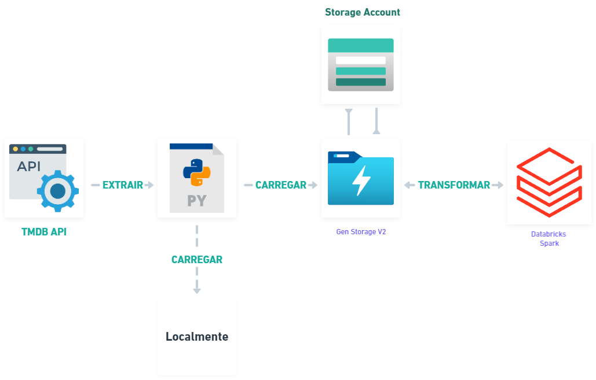

# TMDB

Este código é um script Python para coletar dados do The Movie Database (TMDB) e armazená-los localmente ou fazer upload diretamente para o Azure Blob Storage.





## Pré-requisitos
Antes de executar o script, certifique-se de ter instalado os seguintes pacotes:

- requests
- azure-storage-blob
- python-dotenv

	```
	pip install -r requirements.txt
	```
	
## Configuração
Antes de executar o script, você precisa fornecer algumas configurações no arquivo .env. Certifique-se de criar um arquivo .env no mesmo diretório do script e adicione as seguintes variáveis:


API_KEY: sua chave de API do TMDB

AZURE_KEY: sua chave de conexão do Azure Blob Storage

## Funcionalidades
O script possui as seguintes funcionalidades:

Consulta os dados do TMDB com base nos parâmetros fornecidos, como tipo de conteúdo, data de lançamento, etc.

Salva os dados em formato JSON localmente com a data e hora da consulta e o número da página.

Upload dos arquivos salvos para o Azure Blob Storage, se a opção --local não for fornecida.